# 🌍 Real-Time Tracker

[](https://socket.io/) [](https://leafletjs.com/)

<p align="center">
  
</p>

A dynamic real-time location-sharing web application with cinematic visual effects ✨. Watch multiple users' movements unfold like a thriller movie plot! 🎥

---

## 🎥 Live Demo
[🔗 View Live Demo](https://your-live-demo-url.com)

---

## 🔥 Features

### 📡 Live Location Heatmaps
    
  _"Watch activity hotspots pulse with energy"_

### 🕵️ Espionage-Grade Tracking
- Follow users with smooth marker animations (no jump cuts!)
- 🎯 Sub-50ms position accuracy

### 🕶️ Stealth Mode Disconnects
    
  _"Markers vanish Mission: Impossible style when users disconnect"_

### 🦹 Custom Agent Markers
- Choose from 15+ encrypted icons 🦹‍♂️👽🦸‍♀️

---

## 🚀 Tech Stack

| Layer        | Technology              | Badge                                                                 |
|-------------|----------------------|-------------------------------------------------------------------------|
| **Frontend** | Leaflet.js + CSS Animations |  |
| **Real-Time** | Socket.IO + WebSockets |  |
| **Backend** | Node.js + Express |  |

---

## 🛠️ Installation

```bash
# Clone the repository
git clone https://github.com/your-username/real-time-tracker.git
cd real-time-tracker

# Install dependencies
npm install --silent

# Start the application
npm start
```

---

## 🌐 Usage Demo

```mermaid
sequenceDiagram
    participant UserA
    participant Server
    participant UserB
    UserA->>Server: 📡 Emit location (send-location)
    Server->>UserB: 🎯 Broadcast update (receive-location)
    UserB->>Map: 🚀 Smooth marker transition
    Note over UserB: Marker animates using L.Polyline<br/>with Bézier curves
```



---

## 📡 API Documentation

### Socket.IO Events Matrix

| Event              | Direction        | Payload Example                         | Visual Effect |
|--------------------|----------------|---------------------------------|---------------|
| `send-location`   | Client → Server | `{ lat: 40.7128, lng: -74.0060 }` | 📡 Radar sweep animation |
| `receive-location`| Server → Client | `{ id: 'user123', ...coords }`  | 🎯 Marker parabolic trajectory |
| `user-disconnected`| Server → Client | `{ id: 'user456' }`             | 💥 Marker explosion particle effect |
---

## 📜 License

```
███████╗███████╗███████╗
██╔════╝██╔════╝██╔════╝
█████╗  █████╗  █████╗  
██╔══╝  ██╔══╝  ██╔══╝  
██║     ███████╗███████╗
╚═╝     ╚══════╝╚══════╝
```

ISC Licensed - Track responsibly!

---

## 🎥 Feature Preview

🔹 UI Demo (Add actual screenshots and GIFs here)

---

## 🏆 Pro Tips

1. Use actual animated GIFs showing your UI in action
2. Replace placeholder URLs with actual demo links
3. Add real screenshots with cinematic overlays
4. Include actual sequence diagrams using MermaidJS
5. Use GitHub's native animoji features for section headers

This README blends GitHub’s markdown capabilities with embedded animations and spy-movie aesthetics to create an immersive documentation experience! 🎥🔍
